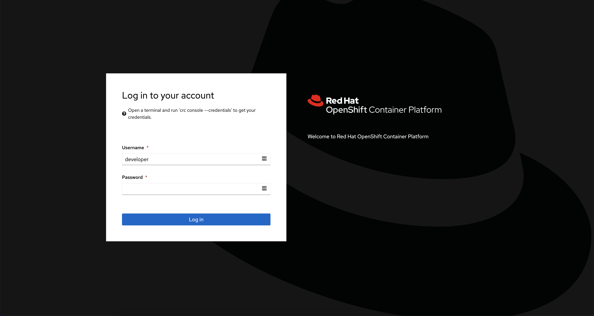
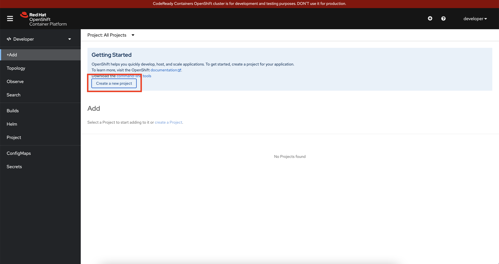
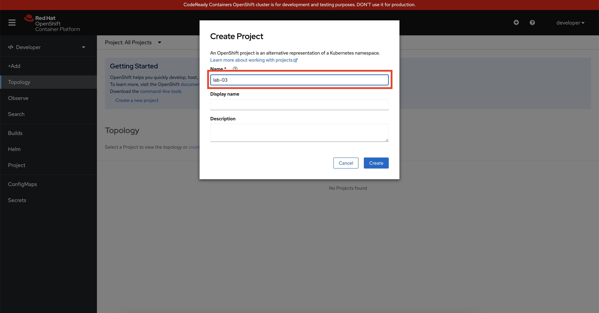
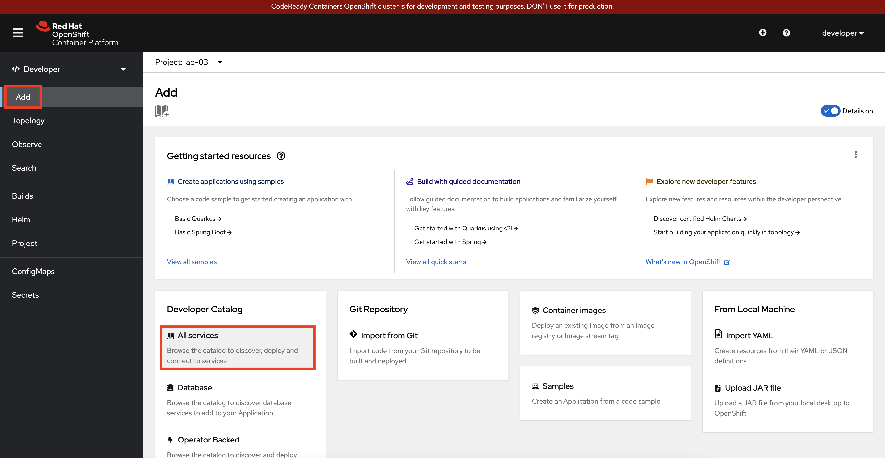
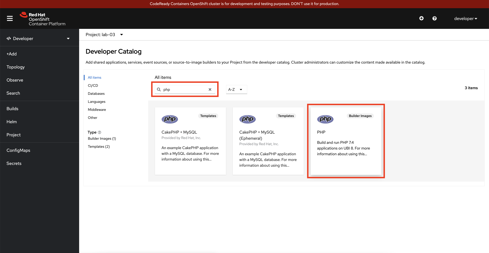
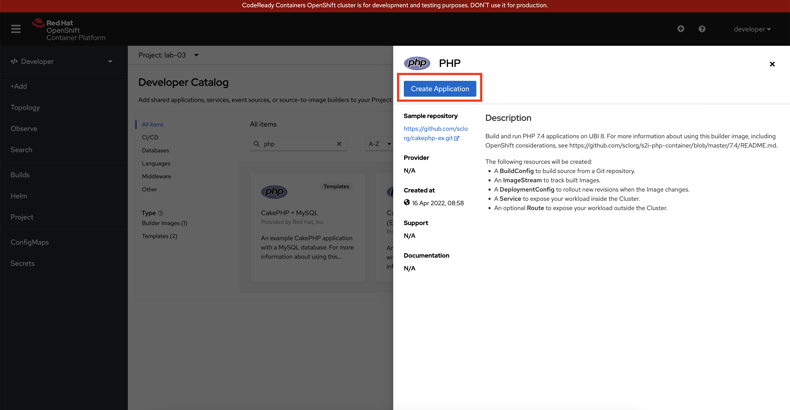
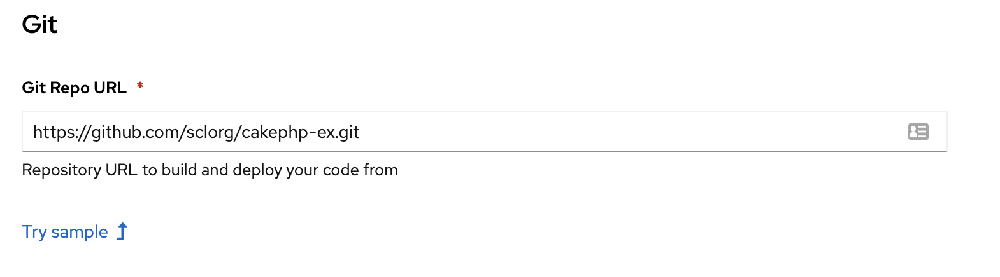
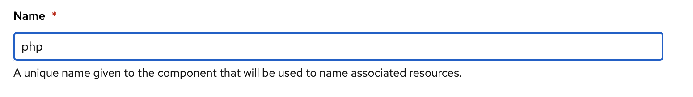
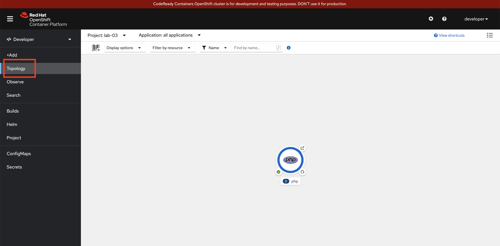
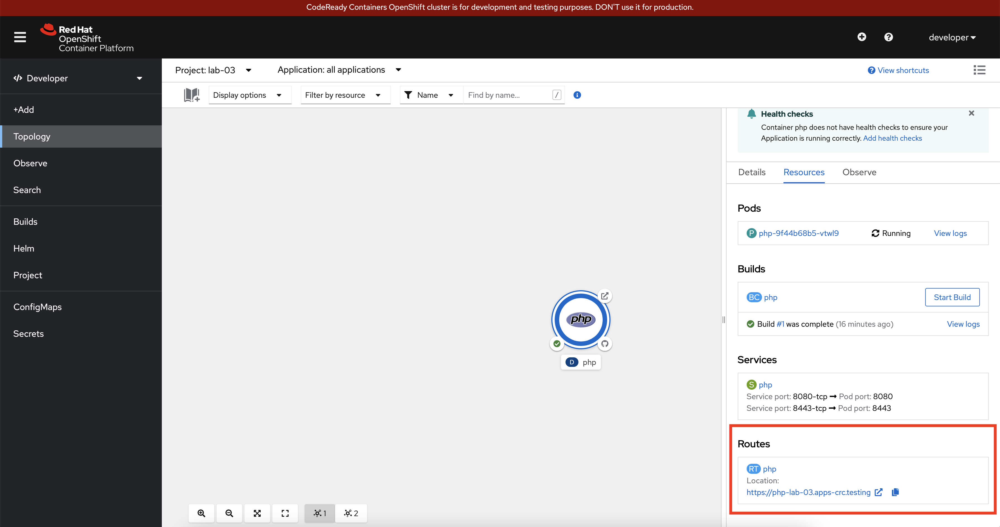

# Lab 03 - Using the web console

In this lab we will explore the Openshift Web Console.

## Task 1: Login to the web console

Open the URL that was shown when issuing the `crc start` command:

```
The server is accessible via web console at:
  https://console-openshift-console.apps-crc.testing
```



Login with the `username` and `password` that were shown when issuing the `crc start` command:

```
Log in as user:
  Username: developer
  Password: developer
```



Click the `Create a new project` button.



Fill out the **Name** field: `lab-03`



Click **+Add** in the menu on the left, after that click on **All Services**.



Enter `php` in the search field and click on the **PHP** builder image on the right.



Click the blue **Create Application** button.



Click the **Try sample** link, to fill out a sample repo.



Use `php` as the **Name** and next click the blue `Create` button.



Next click **Topology** in the menu on the left.



Wait until the build is complete and the pod is running. Next click the link in the route section.

## Task 2: Delete your project

You are also able to delete the project via the `Web Console`.


To delete the project click **Project** in the menu on the left, select **Actions** and click on **Delete Project**.